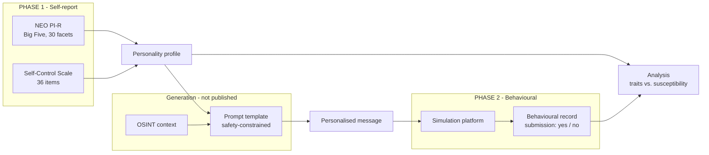

# Personality-Based System Against Spear-Phishing

**Using OSINT and Generative AI**

*Does personality predict who falls for a targeted phishing attack,*
*and what changes when the attack is written for them?*

 

---

A research platform that measures whether a person's personality predicts how
they respond to a targeted phishing attempt, and builds the tooling needed to
test that at scale, so the finding can be turned into defence rather than left
as intuition.

> This repository is the public write-up. The implementation is private; see
> [Why the source is private](#-why-the-source-is-private).

---

## 📌 The problem

Security awareness training generally treats phishing susceptibility as
uniform: train everyone the same way, measure the aggregate click rate,
repeat. That does not match how social engineering actually works. An attacker
writing a pretext by hand instinctively tunes it to the target: their role,
their interests, what they are likely to feel urgency about. The defensive
side has largely not modelled that asymmetry, because doing so requires
measuring something awkward: the person, not the payload.

This project asks a sharper, testable version of the question:

> **Does a person's personality profile predict how they respond to a
> spear-phishing attempt, and does tailoring the pretext to that profile
> change the outcome?**

Specifically, it studies the correlation between demographic variables,
Big Five personality traits (NEO PI-R), trait self-control, and observed
behaviour under a controlled phishing simulation.

If personality is a measurable factor in susceptibility, two consequences
follow. Generic, undifferentiated awareness training is leaving a known
variable unused: the same budget could be spent on the people and traits most
exposed. And the same personalisation that predicts susceptibility could be
used to build more convincing attacks, which is precisely why the generation
side of this work is held closely rather than published.

---

## 📚 Research lineage

This is not a standalone project. It continues an established line of research
into the relationship between phishing susceptibility and personality,
published in peer-reviewed journals and presented at conferences in the field.

**López-Aguilar, P., Urruela, C., Batista, E., Machin, J., & Solanas, A.
(2025).** Phishing vulnerability and personality traits: Insights from a
systematic review. *Computers in Human Behavior Reports*, 20, 100784.

**López-Aguilar, P., Patsakis, C., & Solanas, A. (2022).** The role of
extraversion in phishing victimisation: A systematic literature review.
*2022 APWG Symposium on Electronic Crime Research (eCrime)*.

**López-Aguilar, P., & Solanas, A. (2021).** Human susceptibility to phishing
attacks based on personality traits: The role of neuroticism. *2021 IEEE 45th
Annual Computers, Software, and Applications Conference (COMPSAC)*.

López-Aguilar and Solanas (2021) found no well-established psychological theory
accounting for the role of neuroticism in phishing, and no unanimity across the
literature, attributing the disagreement largely to non-representative samples
and a lack of homogeneity between studies. López-Aguilar et al. (2022) applied
the same systematic treatment to extraversion. López-Aguilar et al. (2025)
synthesised the field more broadly, reporting extraversion, agreeableness and
neuroticism as positively associated with vulnerability, with
conscientiousness acting as a protective factor.

What none of that can do, by the nature of a systematic review, is test the
mechanism directly or measure what happens when a pretext is deliberately
tailored to a profile. The reviews establish association and expose exactly
why the field disagrees: inconsistent samples and incomparable study designs.
This platform is built to answer the same question under conditions the
reviews identified as missing, moving it from reviewed association to
controlled, instrumented experiment.

---

## 🔬 The pipeline

The two phases never meet except at the analysis step. That separation is the
design, not an implementation detail.

---

## ⚙️ The three components

Each solves a different part of the measurement problem.

 

### 🧩 Personality assessment framework

> **Can a psychometric profile be collected and scored reliably at study
> scale?**

A reusable pipeline covering the full lifecycle of a psychometric instrument:
ingesting survey responses, cleaning and validating them, scoring, and
generating individual reports. Two instruments are implemented:

| Instrument | Measures |
|---|---|
| **NEO PI-R** (Costa & McCrae, 1992) | the Big Five across 30 facets |
| **Self-Control Scale** (Tangney et al., 2004) | a 36-item trait measure |

Participants receive their own profile back confidentially; the instrument is
administered independently of the behavioural phase.

 

### 🔤 Personality inference from text

> **Can personality be inferred from written language alone?**

If a full psychometric instrument is required for every subject, the method
does not scale beyond a study, and an attacker certainly is not sending
questionnaires. This module trains models to predict NEO PI-R facet scores
**directly from written language**, testing whether natural text carries
enough signal to approximate a profile. It is both a research question in its
own right and the component that determines whether the broader threat model
is realistic.

A parallel line of work asks whether self-regulation capacity can be predicted
from personality facets alone, using NEO PI-R scores as features.

 

### 🎯 OSINT-informed pretext generation

> **Does a pretext written for the person change the outcome?**

The behavioural phase requires a lure that is credible to a specific person.
This component combines a participant's personality profile with
OSINT-derived personal and professional context to generate a tailored
simulation message. Safety constraints are built into the generation step
itself: output is framed as training material and must contain no active
links, no attachments, and no request for sensitive data, so a generated
message remains a simulation independently of how the delivery platform is
configured.

The **[prompt template](prompt_template.md)** is published here for
reproducibility. It is the part of the method that can be examined and
critiqued without handing over a working capability: what gets asked for, and
the constraints the request is bounded by. What is not published is everything
around it, namely the OSINT collection, the binding of a profile to a prompt,
and the campaign orchestration.

➡️ **[Read the prompt template](prompt_template.md)**

---

## 🧪 Study design

Two deliberately independent phases, so that no single dataset links a
person's personality profile to their phishing outcome outside the research
pipeline.

| | Phase 1 - self-report | Phase 2 - behavioural |
|---|---|---|
| **What** | NEO PI-R + self-control instrument | Personalised phishing simulation |
| **Delivery** | Online questionnaire | Phishing-simulation platform |
| **Disclosure** | Generic study aims only | Deception disclosed after participation ends |
| **Output** | Individual personality profile | One behavioural record per participant, per message |

The simulation platform is configured to record **that** a submission
occurred, not **what** was submitted, yielding a susceptibility measure
without the study ever holding a participant credential.

> **Ethics.** Favourable assessment from the university ethics committee
> preceded any data collection. Consent is collected once, up front, covering
> both phases. All collection is telematic; there is no in-person stage.
> Disclosing the phishing component in advance would have destroyed the
> measurement, which is why the post-participation debrief, rather than an
> upfront warning, is the mechanism that keeps the design both valid and
> ethical.

---

## 🔒 Why the source is private

- The pipeline around the prompt is, by construction, a working method for
  turning a personality profile plus public information about a person into a
  convincing targeted pretext. The prompt design is published so the method
  can be reviewed; the automated collection and orchestration that make it
  operational are not, because describing a method is research and shipping
  it is distribution.
- Phase 2 records behaviour under a deception participants did not consent to
  in advance. Nothing derived from it can be public, regardless of consent
  obtained afterwards.
- Keeping the two phases' data and tooling separated, including from public
  view, is part of what makes the validity argument hold, not a precaution
  added on top of it.

---

**Research in progress.** This describes a methodology that has cleared ethics
review, not results, which do not yet exist.

